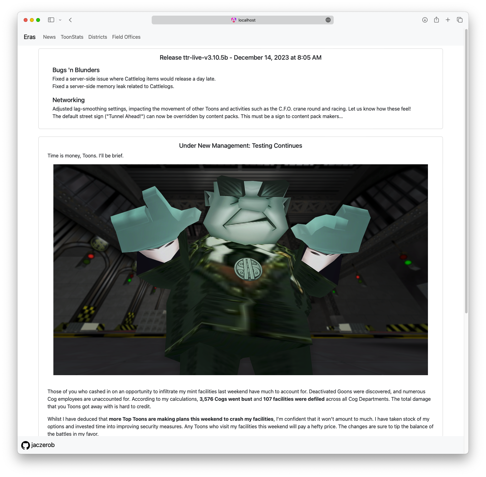

    <h1>Madam Chuckle</h1>
    A full stack web application and launcher daemon for launching and accessing Toontown Rewritten information from the web 
    <small> ⚠️ Not complete, many features not implemented, not open to the public ⚠️</small>
    

### Stack
<ul>
    <li>backend
        <ul>
            <li>Java</li>
            <li>Spring Boot</li>
        </ul>
    </li>
    <li>launcherd
        <ul>
            <li>Golang</li>
            <li>Echo</li>
            <li>Gorilla Websocket</li>
        </ul>
    </li>
    <li>frontend
        <ul>
            <li>Typescript</li>
            <li>Angular</li>
            <li>Bootstrap</li>
        </ul>
    </li>
</ul>

### How to run from source
#### Requirements
<ul>
    <li>node.js</li>
    <li>Java 8</li>
    <li>Maven CLI</li>
    <li>Go 1.18</li>
</ul>

#### Running Madam Chuckle
<ul>
    <li>Clone and cd into repo</li>
    <li>backend
        <ul>
            <li><code>cd backend</code></li>
            <li><code>mvn spring-boot:run</code></li>
        </ul>
    </li>
    <li>launcherd
        <ul>
            <li><code>cd launcherd</code></li>
            <li><code>go run cmd/madamchuckle/main.go</code></li>
        </ul>
    </li>
    <li>frontend
        <ul>
            <li><code>cd frontend</code></li>
            <li><code>npm install</code></li>
            <li><code>ng serve --open</code></li>
        </ul>
    </li>
</ul>
